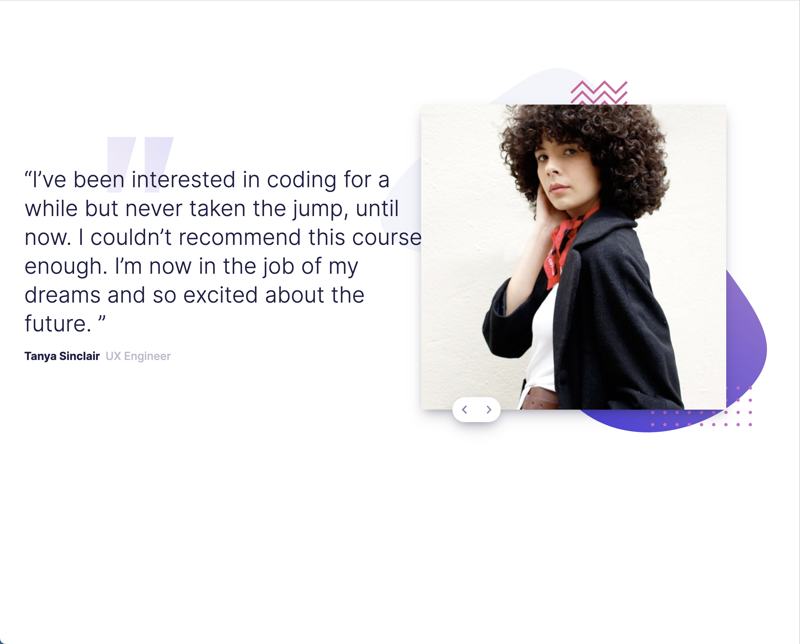

# Frontend Mentor - Coding bootcamp testimonials slider solution

This is a solution to the [Coding bootcamp testimonials slider challenge on Frontend Mentor](https://www.frontendmentor.io/challenges/coding-bootcamp-testimonials-slider-4FNyLA8JL). Frontend Mentor challenges help you improve your coding skills by building realistic projects. 

## Table of contents

- [Overview](#overview)
  - [The challenge](#the-challenge)
  - [Screenshot](#screenshot)
  - [Links](#links)
- [My process](#my-process)
  - [Built with](#built-with)
  - [What I learned](#what-i-learned)
  - [Useful resources](#useful-resources)
- [Author](#author)

**Note: Delete this note and update the table of contents based on what sections you keep.**

## Overview

### The challenge

Users should be able to:

- View the optimal layout for the component depending on their device's screen size
- Navigate the slider using either their mouse/trackpad or keyboard

### Screenshot

#### Testimonials Mobile


#### Testimonials Desktop


### Links

- Site URL: [Coding Bootcamp Testimonials](https://codingbootcamptestimonialssite.netlify.app/)

## My process

### Built with

- Semantic HTML5 markup
- CSS Styled Components
- Flexbox
- CSS Grid
- Mobile-first workflow
- [React](https://reactjs.org/) - JS library
- [Styled Components](https://styled-components.com/) - For styles

### What I learned

Use this section to recap over some of your major learnings while working through this project. Writing these out and providing code samples of areas you want to highlight is a great way to reinforce your own knowledge.

To see how you can add code snippets, see below:

#### I learn how to create variables to apply some styles to a component HTML.

```js
const Container = styled.div`
    max-width: 160rem;
    margin: 0 auto;
    width: 95%;
`;
```

#### In this proyect i practice and implement the Styled Components, every element of the proyect is made it with this.

```js
<Container>Content</Container>
```

#### I learn how to create a Carousel, here is an example about the functionality.

```js
const changeImg = (i, images, next = true) => {
    setLoaded(false);
    const codition = next ? i < images.length - 1 : i > 0;
    const nextIndex = next ? (codition ? i + 1 : 0) : codition ? i - 1 : images.length - 1;
    setCurrentImg(images[nextIndex]);
    setCurrentIndex(nextIndex);
}
```

### Useful resources

- [Styled Components](https://styled-components.com/) - This source help me to learn how style components work with ReactJS.

## Author

- Frontend Mentor - [@JorgeDev7](https://www.frontendmentor.io/profile/JorgeDev7)
- GitHub - [JorgeDev7](https://github.com/JorgeDev7)